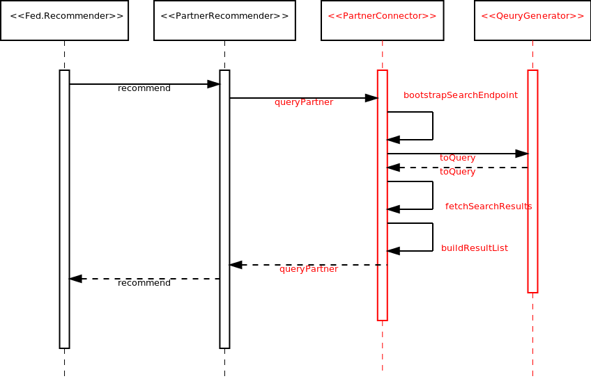
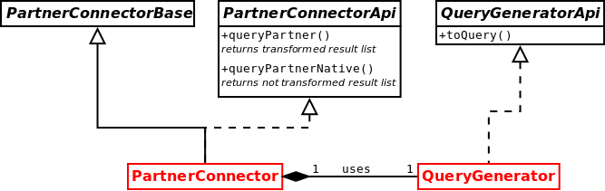

# Guide for Implementing new EEXCESS partner applications using an example based on Open Search and MediaWiki API

## Introduction
What is a partner application? –
A partner application is the part of the EEXCESS federated recommender system that is responsible for the retrieval of search results according to a given query and a search entry point. A user query is passed by the system to a partner application after being pre-processed. The partner application then performs a search request to a specific entry point, optionally translates the search result and passes it back to the federated recommender system.
In productive work the federated recommender has multiple partner applications assigned. 
The federated recommender system and all partner applications run as separate web services.

## How it works
Among others the federated recommender has multiple partner applications registered denoted as *PartnerConnectors*. 
After a user has entered a query it is pre-processed by the recommender system and passed to *PartnerConnectors*, structured as a *SecureUserProfile* object, whereby the query itself is stored as a list of strings in the *SecureUserProfile.contextKeywords* field. 
Which partner applications are chosen for a given query and how this is performed is highly sophisticated but in our case let us assume every partner connector receives any entered query. Beyond the query also settings, defined in each of their respective partner-config.json file, are passed to the partner connector as an *PartnerConfiguration*	 instance. At that stage the query must be prepared out of the given keywords to be understandable for the search engine API the partner connector applies to. For this task a *QueryGenerator* must be implemented. An straightforward implementation would concatenate the keywords syntactically correct according to the search endpoint API. 
With that new prepared query the partner connector requests search results from the search engine behind the search entry point. As last step in the *PartnerConnector’s* task the returned search results must be re-structured to a ResultList as it is expected to be returned by the *PartnerConnectorApi*. 
In other words the result, i.e. JSON formatted, must be parsed and the values assigned to a new *ResultList*.
This guide does not cover the optional part how search results are transformed before they are passed to the *PartnerRecommender*. 
It also does not provide how to build and deploy a web archive. 
It illustrates just a simple implementation example.

## Implementation

### About Open Search and search engine API
This guide is built by an [Open Search](http://www.opensearch.org/Home "www.opensearch.org") example using the [MediaWiki API](http://www.mediawiki.org/wiki/API:Main_page#A_simple_example "Wikipedia MediaWiki API"). 
Open Search is a collection of formats for search entry points. 
It can be used to describe search engines so that client applications can use them and process their search results. 
The MediaWiki API describes, but is not limited to, how search requests can be parametrized; i.e. a search request of articles related to “hermann” is expressed by: [http://en.wikipedia.org/w/api.php?action=opensearch&search=hermann](http://en.wikipedia.org/w/api.php?action=opensearch&search=hermann "example search link"). 
Therefore a partner connector must fetch an Open Search description document (see [www.opensearch.org](www.opensearch.org "www.opensearch.org")) which describes the search engine's entry point(s) before search requests can be issued. This XML document is then interpreted followed by the selection of an adequate search link, as mentioned many times before a “search entry point”. 
It is the *PartnerConnector’s* implementation duty to parse the Open Search description and chose the correct search link. 
For this purpose one may use [OpenSearchDocumentParser](https://github.com/EEXCESS/recommender/blob/knowDev/modules/partners/opensearch/src/main/java/eu/eexcess/opensearch/opensearchDescriptionDocument/parse/OpenSearchDocumentParser.java "an open search document parser") and [SearchLinkSelector](https://github.com/EEXCESS/recommender/blob/knowDev/modules/partners/opensearch/src/main/java/eu/eexcess/opensearch/recommender/searchLink/SearchLinkSelector.java "a search link selector"). 
Normally the OpenSearch description provides sufficient information about how to operate with the search entry point but a slight view on the MediaWiki API may unfold more usable options. 
Note that Open Search describes search entry points and the the result format, but not as in our case would be, the MediaWiki API.

### Effort you need to put into
To achieve a working partner connector one must implement the correct interfaces and set up some vital configurations.

### Interfaces and Implementation
All necessary parts a developer must implement are highlighted in [Fig.1.](#fig1) and [Fig.2.](#fig2). [Fig.1.](#fig1) shows the control flow by an interaction diagram example. [Fig.2.](#fig2)  illustrates the necessary interfaces and a base-implementation that have to be implemented/derived. 
We denote this implementations as *PartnerConnector* and *QueryGenerator*. 

| Time diagram |
| ------------ |
| <a name="fig1"></a>  |
| Fig.1. Invocation and workflow of a partner connector. Highlighted parts need to be implemented.|

| Interfaces |
| ------------ |
| <a name="fig2"></a>  |
| Fig.2. Interfaces the implementation must provide. Hightlighted parts need to be implemented.|

#### Implementing a PartnerConnector:
In general the implementation may consist of following steps below. A detailed sample can be found here.

+ initialization
  + In case of Open Search load the description document, parse and select a proper search entry point. 
  One may use OpenSearchDocumentParser and SearchLinkSelector for that task.
  Otherwise use the searchEndpoint as described in the configuration section as is.
+ perform a query (on *queryPartner()*)
  + prepare a valid query string i.e. by concatenating the given keywords using a *QueryGenerator*
  + perform the query
  + read the search result and create a new return-able *ResultList*
  + optionally transform the result
  + return the *ResultList*

#### Implementing a QueryGenerator:
The query generator is rather a simple thingy. A MediaWiki API valid generator sample can be found [here](https://github.com/EEXCESS/recommender/blob/knowDev/modules/partners/opensearch/src/main/java/eu/eexcess/opensearch/querygenerator/OpensearchQueryGenerator.java "a sample query generator").

## Configuration
### partner-config.json
The configuration is found in *partner-config.json* in the *resources/* folder of the respective partner connector. 
This configuration determines in which classes the implementations reside, where the search engine endpoint is located, the connection in between federated recommender and the partner connector and much more. Irrelevant parameters are described briefly. 
This configuration sample explains the parameters:

```json
{
   /* partner connector name as seen by the federated recommender */
   "systemId": "Opensearch",
 
  /* fully qualified class name of the query generator implementation */
  "queryGeneratorClass": "eu.eexcess.opensearch.querygenerator.QueryGenerator",

  /* fully qualified class name of the partner connector implementation */
  "partnerConnectorClass": "eu.eexcess.opensearch.recommender.PartnerConnector",
  
  /* language(s) the search endpoint provides content */
  "languageContent" : ["de", "en", "ro", "ru"],

  /* search engine endpoint; in case of open search a link to the description document */
  "searchEndpoint" : "http://en.wikipedia.org/w/opensearch_desc.php" ,

  /* whether or not results shall be enriched with links */
  "enableEnriching":"false",

  /* where this partner connector can be found at */
  "partnerConnectorEndpoint": "http://127.0.0.1/eexcess-partner-reference-opensearch-1.0-SNAPSHOT/partner/recommend",

  /* where this partner connector registers itself*/
  "federatedRecommenderURI":  "http://127.0.0.1/eexcess-federated-recommender-web-service-1.0-SNAPSHOT/recommender/",

  /* ebables/disables logging */
  "partnerDataRequestsTrace":"false",

  /* credentials used for partner connector registration */
  "userName": "",
  "password": "",

   /* whether this partner connector supports result transformation
   isTransformedNative = true -> no transformation available
   isTransformedNative = false -> transformation available */
   "isTransformedNative": "true",
   
   /* transformation class, not considered if isTransformedNative=true */
   "transformerClass": "eu.eexcess.opensearch.datalayer.OpensearchTransformer",

   /* tranformation configuration */
   "mappingListTransformationFile":"mapperResultList.xsl",
   "mappingObjectTransformationFile":"mapperObject.xsl",
   "makeCleanupBeforeTransformation":"false"
}
```
### web.xml
The file is responsible for the web archive, a.k.a. war, configuration. 
Wrong settings may lead to a not proper running or even crashing service. 
Usually one does not need to change anything except of the display-name value. 
The *web.xml* file can be found in *src/main/webapp/WEB-INF/* folder. 

```xml
<web-app id="EEXCESS" version="2.4" xmlns="http://java.sun.com/xml/ns/j2ee"  
    xmlns:xsi="http://www.w3.org/2001/XMLSchema-instance" xsi:schemaLocation="http://java.sun.com/xml/ns/j2ee 
	http://java.sun.com/xml/ns/j2ee/web-app_2_4.xsd">

    <!-- General description of your web application -->
    <display-name>EEXCESS Webapp</display-name>
    
	<listener>
       	<listener-class>eu.eexcess.partnerwebservice.PartnerContextListener</listener-class>
    </listener>
    
	<servlet>
		<servlet-name>jersey-servlet</servlet-name>
	    <servlet-class>com.sun.jersey.spi.container.servlet.ServletContainer</servlet-class>
		<init-param>
			<param-name>com.sun.jersey.config.property.packages</param-name>
			<param-value>eu.eexcess.partnerwebservice</param-value>
		</init-param>
		<init-param>
			<param-name>com.sun.jersey.api.json.POJOMappingFeature</param-name>
			<param-value>true</param-value>
		</init-param>
		<load-on-startup>1</load-on-startup>
	</servlet>
	<servlet-mapping>
		<servlet-name>jersey-servlet</servlet-name>
		<url-pattern>/*</url-pattern>
	</servlet-mapping>
</web-app>
```
